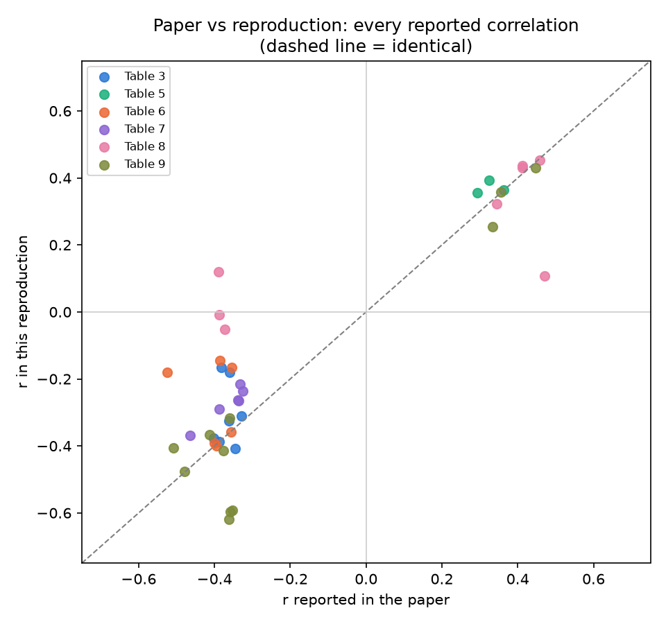
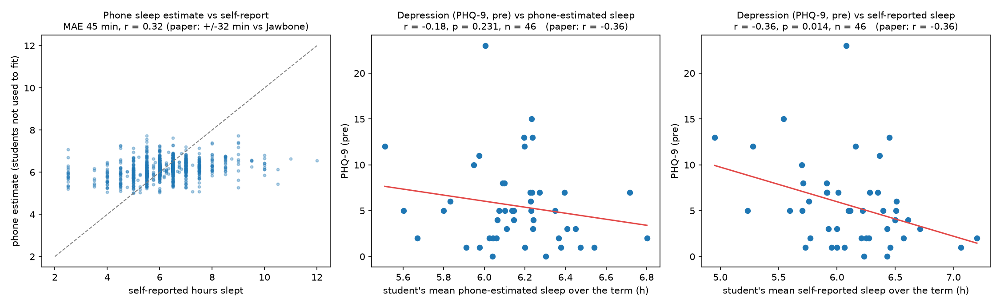
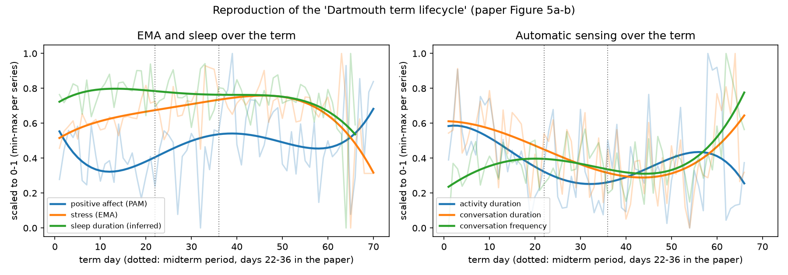
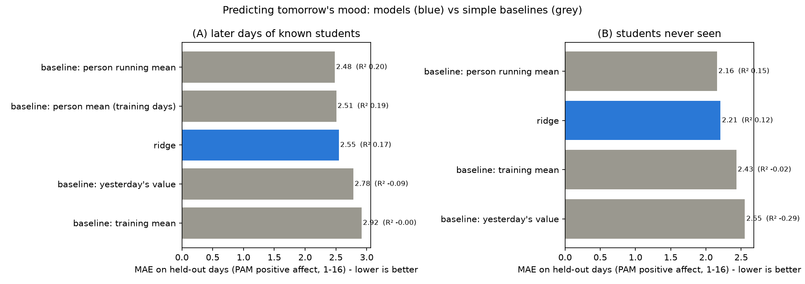
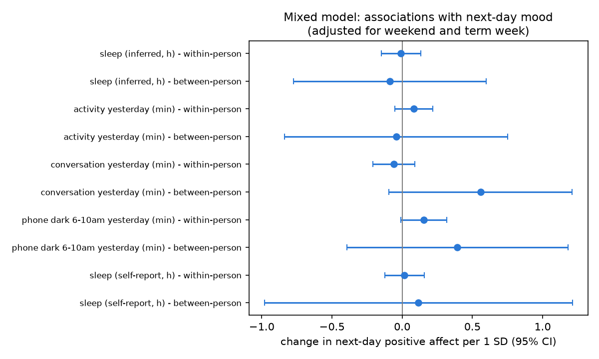
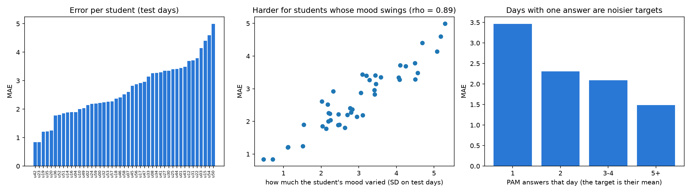

# Sleep, activity, light and mood: a reproduction of *StudentLife* (2014) + an ML extension

This project reproduces a published study with its public data, then tests whether daily behaviour can **predict** mood.

- **Part 1, the paper's own analysis:** the correlations it reports.
- **Part 2, our extension:** a machine-learning model. This part is ours; it is **not** in the paper.

## 1. The paper

| | |
|---|---|
| Title | *StudentLife: Assessing Mental Health, Academic Performance and Behavioral Trends of College Students using Smartphones* |
| Authors | Rui Wang, Fanglin Chen, Zhenyu Chen, Tianxing Li, Gabriella Harari, Stefanie Tignor, Xia Zhou, Dror Ben-Zeev, Andrew T. Campbell |
| Venue | Proceedings of ACM UbiComp 2014, Seattle, pp. 3–14 (UbiComp 10-Year Impact Award, 2024) |
| DOI | [10.1145/2632048.2632054](https://doi.org/10.1145/2632048.2632054) |
| Verified | Full text (authors' PDF via the Internet Archive); metadata via Semantic Scholar and ACM DL |

**Research question.** Does automatically sensed behaviour correlate with students' mental well-being and grades? The paper studies sleep, physical activity, conversation, co-location and mobility, plus stress and mood check-ins. The outcomes are depression (PHQ-9), perceived stress (PSS), flourishing, loneliness and GPA. It also asks how behaviour changes across a 10-week term.

**Why this paper suits a reproduction.**
- It is peer-reviewed and widely cited.
- It reports exact r and p values for every finding (Tables 3–9), so there is something concrete to compare against.
- The dataset is public.
- It covers sleep, activity, a light sensor and mood, which is close to the question behind this project.

**What the paper did.**

| | |
|---|---|
| Participants | 48 students who completed the study (60 joined; 30 undergrad, 18 grad; 38 male, 10 female), Dartmouth CS65 class, Spring 2013 |
| Collection | Android phones, 10 weeks. Continuous sensing (accelerometer, microphone, light, GPS, Bluetooth, Wi-Fi, phone lock/charge), about 8 EMA prompts a day, and surveys before and after the term |
| Inputs | Daily sleep duration (from a phone sleep model), activity duration, conversation frequency and duration, co-locations, travelled distance, indoor mobility. Each is averaged per student over the term and split into day (9–18), evening (18–24) and night (0–9) |
| Targets | PHQ-9, PSS, flourishing and UCLA loneliness (pre and post), spring and overall GPA |
| Method | Pearson correlation between each student's term averages and their survey scores, with no correction for multiple tests |
| Results | 41 correlations with \|r\| ≈ 0.29–0.52. Example: sleep duration vs depression r = −0.360 (pre) and −0.382 (post). Also the "term lifecycle": stress rises and activity, sleep and conversation fall as workload grows |
| Causation | The paper says itself that "it is difficult … to speculate about cause and effect" |

## 2. Data

| Source | What | Why |
|---|---|---|
| Zenodo mirror of the original release ([10.5281/zenodo.3529253](https://doi.org/10.5281/zenodo.3529253), CC-BY-4.0, md5-checked) | Sensing, EMA and surveys | The original host, studentlife.cs.dartmouth.edu, was unreachable during this work |
| Original-release JSON/CSV files from a public GitHub copy, pinned to one commit and md5-checked (`data/github_manifest.json`) | Stress EMA, grades, EMA definitions | The Zenodo conversion **dropped the stress "level" field** and has no grades |

**This is the same dataset as the paper.** We checked the GitHub copy before trusting it:
- Two independent repositories had byte-identical copies.
- All 2,051 stress rows in the Zenodo mirror match it exactly.
- We score the survey files exactly as each instrument's authors define them, and our post-term scores then match the paper's Table 4 **exactly** (see 4.1).

## 3. Method

### Part 1: the paper's methodology (what we copied, and where we had to choose)

| Step | Paper | This reproduction |
|---|---|---|
| Survey scoring | PHQ-9, PSS-10, Flourishing, UCLA-v3 | Same official scoring (reverse items included); one missing item is prorated |
| Activity duration | 10-min windows active if the non-stationary share is above a threshold (not given) | Threshold 0.5 (`config.py`) |
| Conversation | Count and duration per day and epoch; lecture conversations removed using class locations | Count and duration per day and epoch. **Lectures not removed**: no class-location data is released |
| Co-location | Bluetooth devices | Distinct Bluetooth MACs per day |
| Travelled distance | Distance travelled "around campus" (GPS) | GPS fixes with accuracy ≤ 100 m, within 20 km of campus, jumps over 180 km/h dropped |
| Indoor mobility | Walking inside buildings, from a campus access-point map | **Approximation**: active windows while Wi-Fi labels the phone "in[building]". The AP map was never released |
| Sleep | Linear model sleep = Σ αᵢFᵢ, αᵢ ≥ 0, on light, phone usage, activity and sound; trained against Jawbone UP (±32 min) | Same form on the released inputs (longest dark, locked, charging, stationary, silent and quiet stretches each night), fit by non-negative least squares against the students' **self-reported** hours. **A constant term was added**: without it the model was worse than predicting the average (75 vs 48 min error). Result: 45 min error on unseen students, r = 0.32 |
| Valid days | Days with the phone off or left behind removed (no rule given) | Days with at least 16 h of activity sensing |
| Statistics | Pearson r, p | Pearson r, p. We also apply Benjamini–Hochberg FDR across all 250 pairs we tested |
| Term window | 10-week Spring 2013 term | 27 Mar – 4 Jun 2013 (first day in the released deadlines file, plus 70 days) |

**PAM mood score.** PAM is a photo-picking mood check-in. Its score (1–16) is *positive affect*, and valence and arousal come from the photo's grid position (Pollak et al., CHI 2011, Figure 3). This matches the mapping in the `studentlife` R package.

**Stress score.** The stress question's answer codes are not in order (1 a little stressed … 3 stressed out, 4 feeling good, 5 feeling great). We re-order them into a 1 (feeling great) to 5 (stressed out) scale.

### Part 2: our AI/ML extension (not in the paper)

**Question.** Can last night's sleep, yesterday's activity, sociability and phone darkness, the calendar, and the student's recent mood **predict tomorrow's mood**?

| | |
|---|---|
| Target | Daily mean PAM positive affect (1–16), 2,246 student-days from 49 students. Secondary target: daily stress (1–5) |
| Features | Only information available **before** the target day: last night's sleep (estimated and self-reported, bedtime, wake time), yesterday's activity, conversation, co-locations, distance, indoor mobility, exercise, phone-dark minutes (all day and 6–10 am), yesterday's and recent mood and stress, the student's running mean, weekday, week, deadlines |
| Split A: temporal | For each student, the first 60% of days train, the next 20% validate (tuning), the last 20% test. "Can it forecast the rest of the term for people it knows?" |
| Split B: leave-students-out | 5-fold by student. "Does it work for a stranger?" |
| Baselines | Training mean; the student's mean; yesterday's value; the student's running mean |
| Models | Ridge regression, random forest, gradient boosting (scikit-learn), each tuned on the validation days |
| Metrics | MAE (main), RMSE, R², Spearman. 95% CI for the MAE difference vs the best baseline, using a bootstrap that resamples whole students |
| Extra analyses | Ablations by feature group; permutation importance; a within/between-person **mixed model** (statsmodels) for associations |

## 4. Results

### 4.1 Survey scores (paper Table 4)

| Survey | Paper post n, mean, SD | Ours post | Paper pre | Ours pre |
|---|---|---|---|---|
| PHQ-9 | 38, 6.3, 5.8 | **38, 6.3, 5.8** | 40, 5.8, 4.9 | 46, 5.5, 4.6 |
| Flourishing | 37, 42.8, 8.9 | **37, 42.8, 8.9** | 40, 42.6, 7.9 | 45, 42.6, 8.6 |
| PSS | 39, 18.9, 7.1 | **39, 18.9, 7.1** | 41, 18.4, 6.8 | 46, 18.2, 6.9 |
| Loneliness | 37, 40.9, 10.5 | **37, 40.9, 10.5** | 40, 40.5, 10.9 | 46, 40.7, 10.5 |

Post-term values match exactly. The paper's pre-term n is smaller (40–41 vs 45–46): it apparently excluded some students' pre surveys without saying which, so our pre-term correlations use a slightly larger group.

### 4.2 Correlations (paper Tables 3, 5–9): every reported row

All 41 rows are in `results/reproduction_vs_paper.csv`. Summary:

| | |
|---|---|
| Same direction as the paper | **40 / 41** |
| Same direction **and** p ≤ 0.05 | 22 / 41 |
| Agreement between paper r and our r (across the 41 rows) | **r = 0.88** |
| Median \|r\| | Paper 0.373, ours 0.357 |

| Table (outcome) | Rows | Same direction | Also p ≤ 0.05 |
|---|---|---|---|
| 3 (PHQ-9) | 7 | 7 | 4 |
| 5 (flourishing) | 3 | 3 | 3 |
| 6 (PSS) | 6 | 6 | 3 |
| 7 (loneliness) | 6 | 6 | 1 |
| 8 (EMA) | 8 | 7 | 3 |
| 9 (GPA) | 11 | 11 | 8 |

Highlights:

| Finding | Paper r (p) | Ours r (p) |
|---|---|---|
| Conversation frequency (day) ~ PHQ-9 post | −0.387 (0.016) | **−0.387 (0.017)** |
| Conversation duration (evening) ~ flourishing pre | 0.362 (0.022) | **0.363 (0.014)** |
| Conversation duration ~ PSS post | −0.357 (0.026) | **−0.358 (0.025)** |
| Stress EMA ~ PSS pre | 0.458 (0.003) | **0.452 (0.002)** |
| Stress EMA ~ PHQ-9 post | 0.412 (0.010) | **0.431 (0.007)** |
| Activity SD ~ overall GPA | −0.479 (0.004) | **−0.477 (0.008)** |
| Sleep duration (phone model) ~ PHQ-9 pre | −0.360 (0.025) | −0.180 (0.23) |
| **Sleep (self-reported) ~ PHQ-9 pre**, a robustness check | −0.360 (0.025) | **−0.361 (0.014)** |
| **Sleep (self-reported) ~ PSS pre**, a robustness check | −0.355 (0.024) | **−0.343 (0.019)** |
| PAM positive affect ~ flourishing pre | 0.470 (0.002) | 0.108 (0.48), **not reproduced** |
| PAM positive affect ~ PSS pre / post, loneliness post | −0.39 to −0.37 | −0.05 to +0.12, **not reproduced** |



**Sleep and depression.** With our phone-based sleep estimate the link is about half as strong (r ≈ −0.18). With the students' own sleep reports it matches the paper (−0.361 vs −0.360). The finding holds; our reconstruction of the paper's phone sleep classifier is the weak part (Figure 3).



**Positive affect (PAM).** None of the paper's PAM correlations reproduce. We tried four other reasonable definitions (valence, first or last two weeks, unweighted daily means) in `results/sensitivity_checks.csv`, and none comes close. Possible reasons: a different student subset, a different PAM aggregation in the paper, or differences between the released PAM data and what the authors analysed. We can't tell which.

**Multiple testing (our addition).** Of the 250 pairs we tested, 40 have p ≤ 0.05 but only **6 survive FDR correction**: indoor mobility, night activity and activity variability vs spring GPA, and day conversation frequency vs post-term stress. Many single correlations in a sample of about 40 students are fragile. The paper did not correct for this.

### 4.3 Term lifecycle (paper Figure 5)

Reproduced:
- stress peaks at midterm (week 5 mean 3.71 vs 2.81 in week 1)
- activity falls after the first two weeks (82 → about 64–70 min/day)
- conversation duration falls until week 8, then rebounds
- sleep is lowest in the final week

Not reproduced: positive affect does not steadily decline to a low at the end of term.



### 4.4 Part 2 (ours): predicting tomorrow's mood

The numbers below are from **ridge regression**. On the machine this was built on, Windows Smart App Control blocks scikit-learn's tree-model files. Random forest and gradient boosting run in the Colab notebook (section 7), which writes its numbers to the same `results/ml_results.csv`.

| Model (positive affect, 1–16) | Split A MAE (R²) | Split B MAE (R²) |
|---|---|---|
| Baseline: training mean | 2.92 (0.00) | 2.43 (−0.02) |
| Baseline: yesterday's value | 2.78 (−0.09) | 2.55 (−0.29) |
| Baseline: student's mean (training days) | 2.51 (0.19) | n/a |
| **Baseline: student's running mean** | **2.48 (0.20)** | **2.16 (0.15)** |
| Ridge regression, all features | 2.55 (0.17) | 2.21 (0.12) |

- **The model does not beat the simple baseline.** Ridge minus the best baseline: MAE +0.07, 95% CI −0.006 to +0.14. "This student's usual mood" is as good as anything we built.
- **Behaviour alone predicts almost nothing** (Split A ablations, R²):

  | Feature group | R² |
  |---|---|
  | Sleep only | −0.006 |
  | Activity and social only | −0.004 |
  | Phone darkness only | 0.001 |
  | Calendar and workload only | −0.004 |
  | Everything except mood history | 0.001 |
  | Mood history only | 0.188 |
- **Permutation importance** agrees: the model relies on the student's running mean and last three days of mood. The behavioural features add almost nothing.
- **Stress** shows the same pattern: yesterday's stress (MAE 0.67) beats every model.



**Within-person associations (mixed model, per 1 SD, 95% CI):**

| Predictor | Within-person | Between-person |
|---|---|---|
| Sleep (phone model) | −0.01 (−0.15, 0.13) | −0.09 (−0.77, 0.60) |
| Sleep (self-report) | 0.02 (−0.12, 0.16) | 0.12 (−0.98, 1.21) |
| Activity yesterday | 0.08 (−0.05, 0.22) | −0.04 (−0.84, 0.75) |
| Conversation yesterday | −0.06 (−0.21, 0.09) | 0.56 (−0.10, 1.21) |
| Phone dark 6–10 am yesterday | 0.15 (−0.01, 0.32) | 0.39 (−0.39, 1.18) |

None is significant at 0.05. A night with more sleep than usual was **not** followed by a measurably better mood the next day. All effects are small compared with mood's day-to-day spread (SD ≈ 2.9).



**Error analysis.**
- Errors range from 0.8 to 5.0 across students, and they follow how much each student's mood swings (Spearman ρ = 0.89).
- Days with a single PAM answer have twice the error of days with five or more (3.5 vs 1.5). Much of the target is measurement noise.
- About a quarter (26%) of all variation in daily mood is between students.



## 5. Correlation → association → prediction → causation

| Level | What this project can say |
|---|---|
| Correlation | Students who **report** sleeping less over the term score higher on depression (r ≈ −0.36). Students around more conversation report less stress |
| Association (adjusted) | Within a student, day-to-day changes in sleep, activity and morning phone-darkness are **not** clearly linked to next-day mood |
| Prediction | Passive behaviour data does **not** improve next-day mood prediction beyond the person's own mood history |
| Causation | **Not supported by this design.** It is observational, and sleep and mood can both be driven by workload, illness or personality. Depression can also cause poor sleep, not only the other way round. Only randomised experiments can test "sleep more → feel better" |

**Morning sunlight.** This dataset cannot test it. The phone's light sensor records darkness *around the phone*, and a phone in a pocket or bag counts as dark. Our "phone dark 6–10 am" feature is a weak, indirect proxy. Its small within-person estimate (+0.15, CI includes 0) says nothing reliable about light exposure.

## 6. Why our results differ from the paper

1. **Sleep inference.** The paper's sleep classifier (weights trained on Jawbone ground truth) was not released. Our refit from the released inputs is much noisier (45 vs 32 min error).
2. **Undocumented choices**: the activity threshold, valid-day rules, lecture-conversation removal (impossible without class locations), indoor mobility (no AP map), and how PAM and EMA were aggregated.
3. **Different student subsets.** Pre-term survey n is 45–46 here vs 40–41 in the paper. The dataset has 49 students; the paper analysed 48.
4. **Small samples.** With n = 40, the 95% CI of r = −0.36 spans roughly −0.60 to −0.06. Correlations of this size naturally move by ±0.15 between reasonable analyses.
5. **Data release vs analysis data.** The public files may not be exactly the authors' working data, as the lost stress field in one mirror shows.

## 7. How to reproduce

```bash
cd mood_research
pip install -r requirements.txt
python run_all.py              # downloads + checks the data (230 MB), then everything; about 10 min the first time
python run_all.py --refresh    # rebuild the cached features from the raw data
```

`run_all.py` runs `get_data.py` (download and md5 checks), then `src/features.py`, `src/eda.py`, `src/reproduce.py` and `src/extension.py`. Results go to `results/` and figures to `figures/`. Seeds are fixed (`config.SEED = 42`).

**Windows Smart App Control.** If you see "An Application Control policy has blocked this file", the tree models are blocked. Everything else still runs (ridge only). For the full model set:
1. `python make_colab_bundle.py` makes a 0.3 MB `colab_bundle.zip`.
2. Open `colab_ml_extension.ipynb` in Google Colab, upload the zip and run all cells.
3. Unzip the downloaded results into this folder.

## 8. Project structure

```
mood_research/
  get_data.py               download + checksum the data
  run_all.py                run the whole pipeline
  make_colab_bundle.py      pack code + features for Colab
  colab_ml_extension.ipynb  Part 2 with the full model set
  data/github_manifest.json md5 of each original-release file
  src/config.py             paths and the analysis choices the paper leaves open
  src/load.py               raw tables -> tidy frames (PAM, stress, sleep EMA, grades, deadlines)
  src/surveys.py            PHQ-9, PSS, flourishing, loneliness scoring
  src/features.py           sensors -> daily features, sleep model, EMA per day
  src/paper_values.py       every r/p from the paper's tables
  src/eda.py                exploratory analysis
  src/reproduce.py          PART 1 - the paper's analysis + comparison + sensitivity
  src/extension.py          PART 2 - our ML extension
  results/                  CSV/JSON outputs        figures/  all plots
```

## 9. Limitations

- The paper's phone sleep classifier could not be recreated faithfully. Self-reported sleep is a different (subjective) measure.
- There is no measure of actual light exposure, so morning-sunlight claims can't be tested here.
- 49 students from one class at one college over one term. The group is small and not representative.
- EMA answers are sparse and missing more often late in term. Days with one PAM answer are noisy targets.
- Indoor mobility and conversation are approximations of the paper's features (see the table in section 3).
- The ML extension predicts the *next* day only. Other horizons or person-specific models may behave differently.
- All results are observational and associational.

## References

- Wang, R., Chen, F., Chen, Z., Li, T., Harari, G., Tignor, S., Zhou, X., Ben-Zeev, D., Campbell, A. T. (2014). StudentLife. *UbiComp '14*, 3–14. doi:10.1145/2632048.2632054
- Fryer, D. (2019). studentlife data in RData format. Zenodo. doi:10.5281/zenodo.3529253
- Chen, Z. et al. (2013). Unobtrusive sleep monitoring using smartphones. *PervasiveHealth '13*. doi:10.4108/icst.pervasivehealth.2013.252148
- Pollak, J. P., Adams, P., Gay, G. (2011). PAM: a photographic affect meter. *CHI '11*. doi:10.1145/1978942.1979047
- Kroenke, K., Spitzer, R. L., Williams, J. B. (2001). The PHQ-9. *J Gen Intern Med* 16(9), 606–613
- Cohen, S., Kamarck, T., Mermelstein, R. (1983). A global measure of perceived stress. *J Health Soc Behav* 24, 385–396
- Diener, E. et al. (2010). New well-being measures. *Social Indicators Research* 97, 143–156
- Russell, D. W. (1996). UCLA Loneliness Scale (Version 3). *J Pers Assess* 66(1), 20–40
